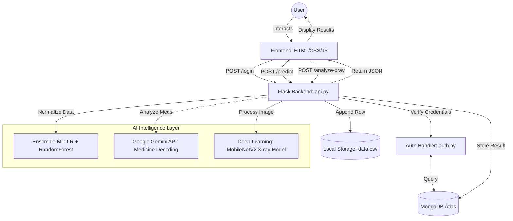
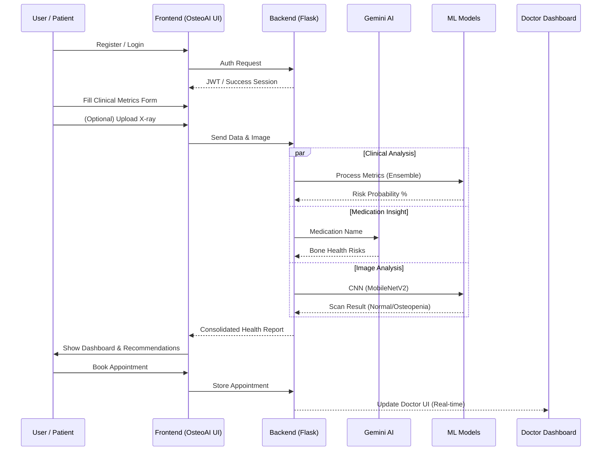

# OsteoAI Application Flowchart

This document provides a detailed technical architecture and user flow for the **OsteoAI** platform.

## 1. System Overview

The application is built on a **Flask (Python)** backend, a **MongoDB Atlas** database, and a **Vanilla JS/CSS/HTML** frontend with a focus on premium aesthetics and AI-driven clinical insights.

## 2. Technical Architecture Flow

## 3. Detailed User Journey

## 4. Component Interactions

| Component | Responsibility | Technologies |
| :--- | :--- | :--- |
| **Logic** | Core system orchestration | Flask, Python |
| **Prediction** | Clinical risk evaluation | Scikit-Learn (LR, RF) |
| **Vision** | X-ray analysis | PyTorch, MobileNetV2 |
| **Medication** | Medication hazard detection | Google Gemini API (Pro) |
| **Storage** | User data & History | MongoDB Atlas, CSV |
| **UI/UX** | Patient & Doctor Portals | CSS Grid/Flexbox, Glassmorphism |

---

> [!TIP]
> Each prediction is backed by an **Ensemble Engine** that averages probabilities from multiple models to ensure high-confidence results (currently ~92.5% accuracy).
