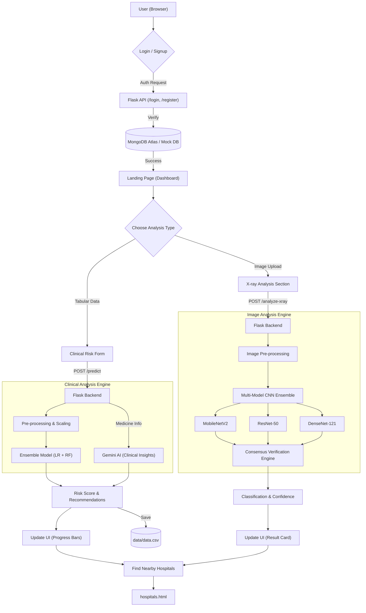

# OsteoAI - Advanced Bone Health Analytics 🦴

OsteoAI 2.0 is a deep-tech healthcare platform that leverages dual-mode AI to predict and screen for Osteoporosis risks using clinical data and X-ray imaging.

## 🚀 Key Features (v2.0)
- **AI X-ray Analysis**: Multi-Model CNN Ensemble (MobileNetV2, ResNet-50, DenseNet-121) for high-accuracy, consensus-based bone density assessment.
- **AI Consensus Verification**: Transparent diagnostic deep-dive exposing individual CNN model predictions for doctor verification.
- **Diagnostic History Tracking**: Secure MongoDB logging of past clinical and X-ray assessments for longitudinal patient review.
- **Doctor & Admin Dashboards**: Dedicated administrative portals for reviewing global patient data and system health metrics.
- **IoT Healthcare Dashboard**: ESP32-based smart clinical environment monitoring (Temperature, Humidity, Motion) and hardware automation.
- **Ensemble Risk Prediction**: High-performance combination of **Logistic Regression** and **Random Forest** (92.5% accuracy).
- **Gemini AI Integration**: Uses Google Gemini to analyze medication names and provide real-time clinical insights and risk adjustments.
- **Patient Clustering**: K-Means unsupervised learning for automated risk segmentation.
- **Production-Ready Architecture**: 
  - **Waitress WSGI**: High-stability server for production environments.
  - **Hackathon Mode**: Built-in automatic fallback to Mock DB if cloud connection is unavailable.
  - **Environment Security**: Sensitive keys managed via `.env` files.

## 🛠 Tech Stack
- **Frontend**: HTML5, CSS3 (Glassmorphism), JavaScript (Vanilla)
- **Backend**: Python (Flask)
- **AI/ML**: PyTorch (CNN), Scikit-learn (Ensemble), Google Gemini (LLM)
- **Persistence**: MongoDB Atlas & Local CSV Logging

## 📊 Application Flow


## 📦 Project Structure
```text
├── data/                    # Local datasets (CSV & X-ray)
├── models/                  # Trained ML/DL model weights
├── src/                     # Core training & evaluation scripts
├── image_analysis/          # X-ray training & inference logic
├── landing_page/            # Web frontend (UI/UX)
├── ../admin_dashboard/      # Doctor & Admin Portal (Separate service)
├── ../iot_dashboard/        # ESP32 Smart Infrastructure Monitoring
├── api.py                   # Main Flask API
├── wsgi.py                  # Production server entry point
└── results.txt              # Performance history & logs
```

## 🛠 Installation & Setup

1. **Install dependencies:**
   ```bash
   pip install -r requirements.txt
   ```

2. **Run in Production Mode (Recommended):**
   ```bash
   python wsgi.py
   ```

3. **Run in Development Mode:**
   ```bash
   python api.py
   ```
   The app will be available at `http://localhost:8000`.

## 📊 Performance Summary
- **Ensemble Accuracy**: 92.5% (Full Dataset)
- **X-ray Val Acc**: 72.82% (Preliminary Training)

## ⚖️ Disclaimer
This project is an AI-based screening tool and should not be used in place of professional medical advice or clinical diagnosis.
